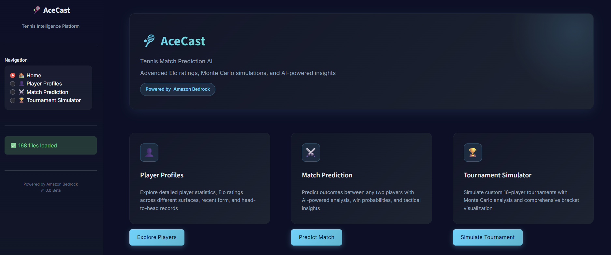
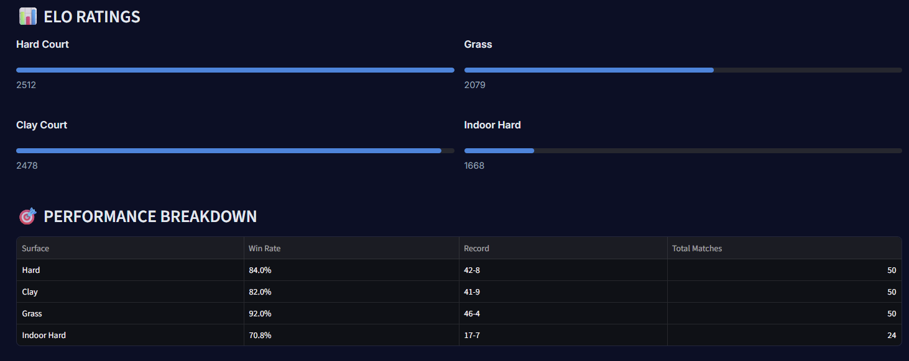
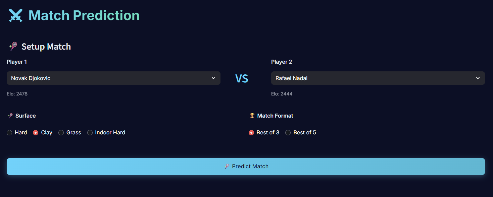
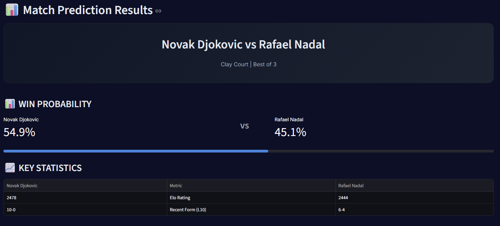
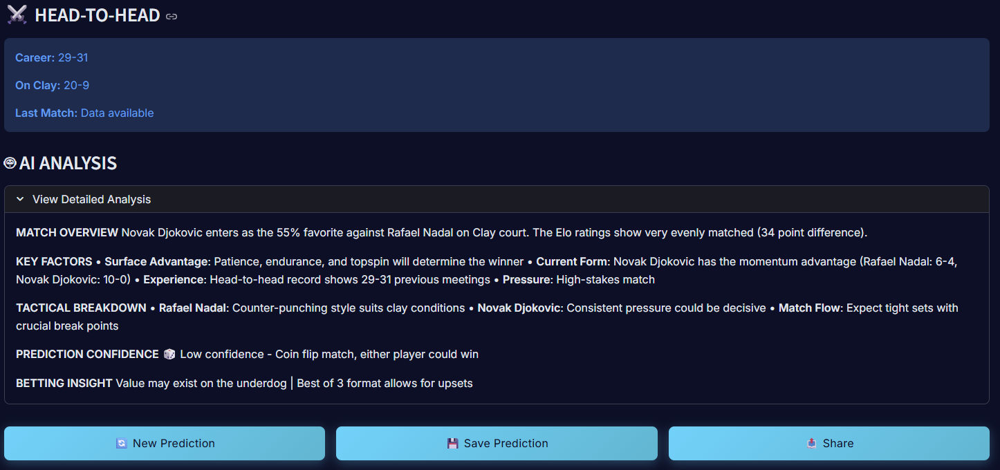
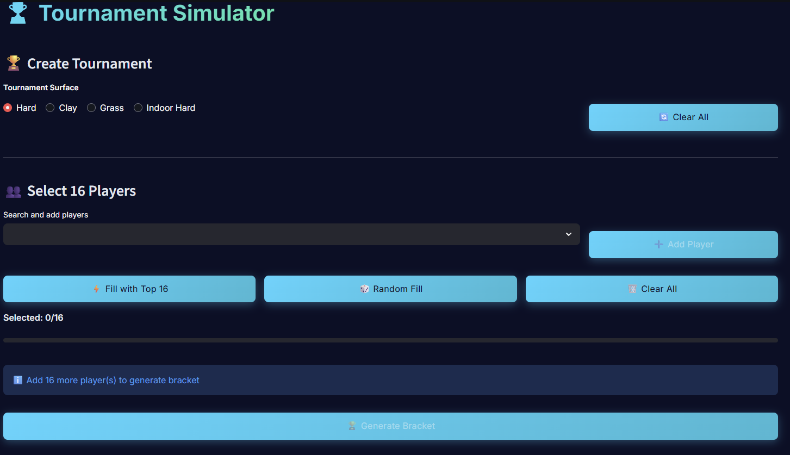
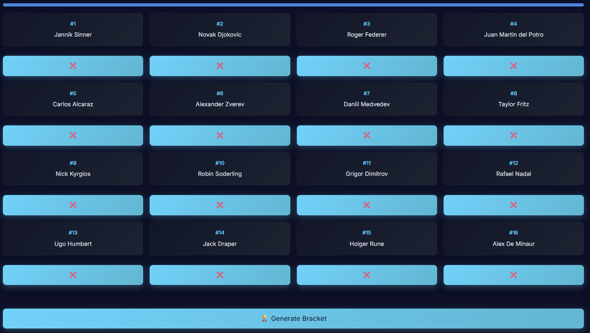
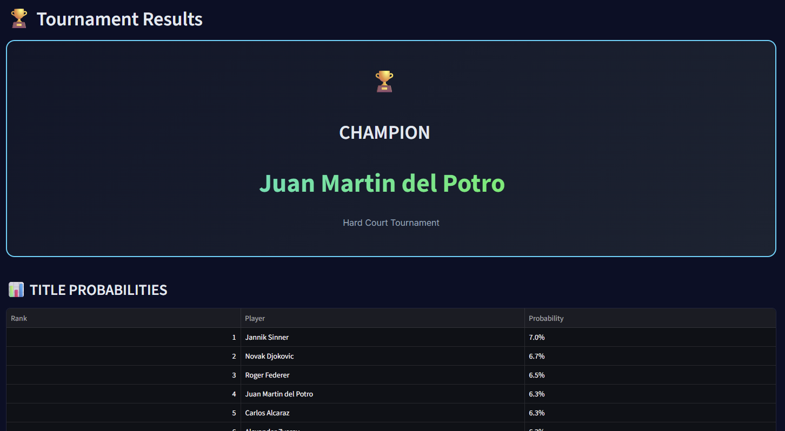
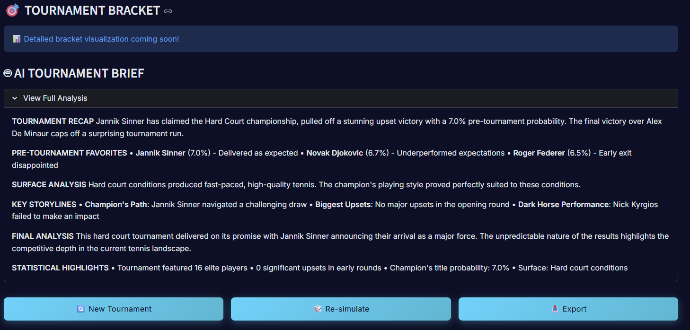

# 🎾 Tennis AceCast

**AI-Powered Tennis Match Prediction & Analysis Platform**

[](https://tennisacecast.streamlit.app/)
[](https://www.python.org/)
[](https://aws.amazon.com/bedrock/)
[](https://streamlit.io/)

*Elo ratings • Match Predictions • Tournament simulations • AI-powered insights*

🎯 **[Try It Live](https://tennisacecast.streamlit.app/)**


---

## 📖 Story Behind the Project

This project was born during the **AWS Tech Bootcamp at Tufts University**, where I learned to build generative AI applications using Amazon Bedrock, PartyRock, and Amazon Q. What started as a workshop exercise transformed into a full-fledged tennis prediction platform—**built in under 3 hours** while I had access to the free AWS resources!
Since the workshop provided time-limited access to AWS Bedrock, I hustled to make the most of this window and built something I'm genuinely passionate about before my credits expired.

**What I Learned:**
- 🤖 Prompt engineering and LLM integration
- 🔗 Using the Bedrock API for generative AI applications  
- 📚 Building "chat with your documents" features using knowledge bases and embeddings
- 🧑‍💻 Leveraging Amazon Q Developer for rapid coding and debugging
- ⚡ Serverless architecture with AWS Lambda

### 🎾 Why Tennis?

As someone who has **played professional tennis tournaments** (yes, my profile is actually in the ATP CSV files used by this app!), I wanted to combine my passion for tennis with cutting-edge AI. This platform doesn't just predict matches—it understands the nuances of different playing surfaces, player psychology, and the countless variables that make tennis so unpredictable.

**Fun Fact:** I'm in my own dataset! 🎾


---

## ✨ Features

### 👤 Player Profiles
- Comprehensive player statistics
- Surface-specific Elo ratings
- Career trajectory analysis
- Recent form tracking
- Head-to-head records


*Novak Djokovic'sperformance breakdown by surface with win rates and match history*

---
### 🎯 Match Prediction
- AI-powered match analysis
- Win probability calculations
- Tactical breakdown
- Surface advantage analysis
- Betting insights


*Match prediction interface for Djokovic vs Nadal on clay*



*Win probability visualization with key statistics comparison*



*Comprehensive AI-powered match analysis with tactical insights and head-to-head history*

---
### 🏆 Tournament Simulator
- Monte Carlo simulations
- 16-player bracket generation
- Upset risk analysis
- Path to championship tracking
- Interactive bracket visualization


*Create custom 16-player tournaments with surface selection*



*Complete tournament bracket with seeded players*



*Championship results with title probabilities*



*AI-generated tournament analysis with key storylines and predictions*

---
### 📊 Advanced Analytics
- Multi-surface Elo system
- Recency-weighted ratings
- Historical performance data
- Statistical modeling
- Real-time updates

---

## 🚀 Quick Start

### Prerequisites

```bash
Python 3.8+
AWS Account with Bedrock access
ATP match data in CSV format
```

### Installation

```bash
git clone https://github.com/freestyledjokic/tennis_acecast.git
cd tennis_acecast
pip install -r requirements.txt
```

### Configuration

**1. Set up AWS credentials:**
```bash
aws configure
```

**2. Add ATP match data:**
```bash
data/
├── atp_matches_2023.csv
└── atp_matches_2024.csv
```

**3. Configure AI prompts:**
```bash
mkdir prompts
# Add your custom system prompt to prompts/system.txt
```

### Run the App

**Web Interface:**
```bash
streamlit run streamlit_app.py
# Navigate to http://localhost:8501
```

**Command Line - Match Prediction:**
```bash
python app.py match \
  --playerA "Jannik Sinner" \
  --playerB "Carlos Alcaraz" \
  --surface hard \
  --csv data/atp_matches_2024.csv \
  --model-id anthropic.claude-3-sonnet-20240229-v1:0
```

**Command Line - Tournament Simulation:**
```bash
python app.py tournament \
  --players "Jannik Sinner,Carlos Alcaraz,Novak Djokovic,Daniil Medvedev" \
  --surface hard \
  --csv data/atp_matches_2024.csv \
  --model-id anthropic.claude-3-sonnet-20240229-v1:0 \
  --simulate 1000
```

---

## 📁 Project Structure

```
tennis_acecast/
├── 📱 streamlit_app.py      # Main Streamlit application
├── ⚙️ app.py                 # CLI application
├── 🎯 elo.py                 # Core Elo rating system
├── 📊 elo_system.py          # Streamlit-friendly Elo wrapper
├── 🎨 ui/                    # UI modules
│   ├── profiles.py          # Player profile interface
│   ├── match.py             # Match prediction interface
│   └── tournament.py        # Tournament simulation interface
├── 📂 data/                  # ATP match data (CSV files)
├── 💬 prompts/               # AI system prompts
└── 📖 README.md              # This file!
```

---

## 🧠 How It Works

### Elo Rating System
The backbone of AceCast is a sophisticated **surface-specific Elo rating system**:

- **Separate ratings** for hard, clay, grass, and indoor hard courts
- **Recency weighting** to prioritize recent performance
- **Head-to-head tracking** for rivalry analysis
- **Match history analysis** for form trends

### AI Integration
Powered by **Amazon Bedrock** and **Claude models**:

- **Contextual Analysis:** Feeds statistical data into LLM prompts
- **Match Insights:** Generates tactical breakdowns and predictions
- **Tournament Briefs:** Creates comprehensive tournament narratives
- **Upset Detection:** Identifies potential surprises based on form and matchups

### Data Processing
- ATP CSV format ingestion
- Automatic player name normalization
- Surface type standardization
- Historical match tracking

---

## 🛠️ Technologies

### Core Stack
- **Frontend:** Streamlit
- **Backend:** Python 3.8+
- **AI/ML:** Amazon Bedrock (Claude models)
- **Data:** Pandas, NumPy
- **Cloud:** AWS (Bedrock, Lambda)

### AWS Services
- **Amazon Bedrock:** Generative AI model access
- **Amazon Q Developer:** Code assistance and debugging
- **AWS Lambda:** Serverless functions (planned)

### Supported Models
- `anthropic.claude-3-sonnet-20240229-v1:0`
- `anthropic.claude-3-haiku-20240307-v1:0`

---

## 📊 Data Format

ATP CSV files should include these columns:

| Column | Description |
|--------|-------------|
| `tourney_date` | Tournament date (YYYYMMDD) |
| `surface` | Court surface type |
| `winner_name` | Match winner name |
| `loser_name` | Match loser name |
| `score` | Final match score |
| `best_of` | Match format (3 or 5 sets) |
| `round` | Tournament round |

---

## 🔮 Future Roadmap

This is just the beginning! Here's what's coming next:

### 🎯 Short-term Goals
- [ ] Enhanced bracket visualization with interactive trees
- [ ] Live tournament tracking integration
- [ ] Mobile-responsive design improvements
- [ ] Export predictions to PDF reports

### 🚀 Long-term Vision

**The Ultimate Tennis Intelligence Platform**

Building the **most sophisticated tennis match predictor** by combining:

- 🏆 **Professional Player Insights:** Interviews with players from around the world
- 📈 **Real-time Data Tracking:** Live match statistics and player performance
- 🧠 **Lifetime Experience Models:** Incorporating decades of tennis knowledge
- 🌍 **Global Perspective:** Insights from different playing styles and cultures
- 📊 **Advanced ML Models:** Deep learning for injury risk, fatigue analysis, mental state
- 💬 **Community Predictions:** Crowd-sourced insights from tennis enthusiasts

**Goal:** Create an AI that doesn't just predict tennis—it *understands* tennis the way a lifelong player and coach would.

---

## 🤝 Contributing

Contributions are welcome! Whether you're a tennis enthusiast or developer:

1. Fork the repository
2. Create a feature branch 
3. Make your changes
4. Add tests if applicable
5. Commit your changes
6. Push to the branch
7. Open a Pull Request

### Areas for Contribution
- 📊 Data collection and preprocessing
- 🤖 AI model improvements
- 🎨 UI/UX enhancements
- 📝 Documentation
- 🧪 Testing and validation

---

**⭐ Star this repo if you find it useful!**
